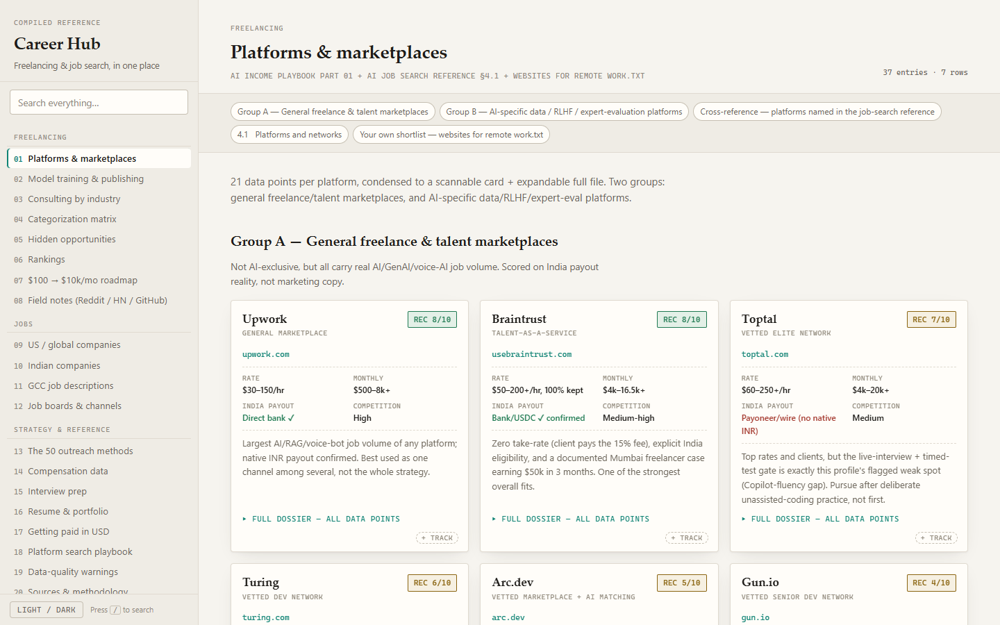

# Career Hub

A local web app that pulls four separate research documents — freelancing
platforms, target companies, outreach methods, saved job descriptions — into a
single browsable UI, and tracks which of them have actually been approached.

> **Private by design.** This repository contains personal career research:
> target-company lists, compensation data, and saved job descriptions (one of
> which names a third party who shared a lead privately). Keep it private.



## What it does

- **One nav instead of four documents.** 20 sections under three groups —
  Freelancing, Jobs, Strategy & reference — replacing four HTML files that had
  to be opened separately and searched one at a time.
- **Full-text search across everything**, ranked so that a hit in a company or
  platform *name* outranks a passing mention in body copy.
- **A tracker.** Mark any company row or platform card with a status
  (Interested / Applied / In progress / Rejected / Closed) and a note. Marked
  rows are tinted, the sidebar counts them per section, and **My tracker**
  collects them in one view.
- **Light and dark themes**, a per-section jump list, and keyboard navigation.
- **No network calls.** No CDN, no external fonts, no telemetry. Works offline.

## Run

```
cd career-hub
python -m pip install -r requirements.txt      # first time only
python -m uvicorn main:app --port 8020
```

Then open <http://localhost:8020>.

Use `python -m uvicorn`, not bare `uvicorn` — on the machine this was built for,
uvicorn is installed but is not on the PATH. Full instructions, including how to
rebuild after editing a source document and what to do when the port is busy,
are in [cmd.txt](cmd.txt).

## What's in it

**Freelancing** — platform dossier (37 platforms, 21 data points each) · model
training & publishing · consulting rates by industry · categorization matrix ·
hidden opportunities · rankings · $100 → $10k/mo roadmap · field notes

**Jobs** — US / global companies · Indian companies · 7 saved GCC job
descriptions · job boards and hidden hiring channels

**Strategy & reference** — the 50 outreach methods · compensation data ·
interview prep · résumé & portfolio · getting paid in USD · platform search
playbook · data-quality warnings · sources

## Architecture

Python 3.12 · FastAPI · vanilla JS, no framework · ~3,000 lines.

| File | Role |
|---|---|
| `build_content.py` | Reads the source documents, emits `static/content.json` |
| `method_details.py` | The "How it works" paragraphs on the 50 methods |
| `main.py` | Serves the static app; owns only the tracker state |
| `static/app.js` | Nav, search, tracker overlay |
| `state.json` | Your tracker data — gitignored, never committed |

The server owns almost nothing. Content is static and pre-built; the only
runtime state is the tracker, kept in `state.json` and written via a temp file
and an atomic replace so an interrupted write can't truncate it.

## How the content gets here

`build_content.py` reads the source documents and writes `static/content.json`
and `static/playbook-data.js`. **Section bodies are copied verbatim** — this app
never becomes a second, diverging copy of the research. The originals stay
authoritative:

| Source | Feeds |
|---|---|
| `Job search/Freelancing/ai-income-playbook.html` | all 8 Freelancing sections |
| `Job search/US remote jobs/us-remote-ai-jobs-guide.html` | companies, boards, comp, interview, résumé, search playbook |
| `Job search/ai-target-companies-and-outreach-strategy.html` | India, global, the 50 methods, USD payment, data fixes |
| `Job search/gcc jds/*.md` | GCC job descriptions |
| `Job search/websites for remote work.txt` | the shortlist inside Platforms |
| `career-hub/method_details.py` | the "How it works" paragraphs on the 50 methods |

Source paths resolve through `find_source()`, which tries several known
locations rather than dying when a folder moves — `Freelancing/` moved under
`Job search/` on 2026-09-01 and the build followed it with no edit.

**Edit a source document, then re-run the build:**

```
python build_content.py
```

It fails loudly if a source's section layout changes, rather than silently
emitting a half-empty page. Refresh the browser afterwards; no restart needed.

The AI Income Playbook renders its cards, matrix, rankings, roadmap and field
notes from JavaScript data. Rather than re-typing that, the build lifts that
block out of the file into `static/playbook-data.js`, and the hub calls
`renderPlaybook()` once its sections are in the DOM.

### The 50 outreach methods

The source gives each method a title and one summary line, rendered as table
rows. The hub reshapes those into cards and adds a **How it works** paragraph
(3–5 lines) under each. Those paragraphs are **not from the source document** —
they live in `method_details.py`, describe mechanics only (what you do, what the
artifact is, why it reaches a hiring team), and render in their own labelled
block so source and addition never blur. Delete an entry there and that card
falls back to the source's own line. The build asserts all 50 methods parse.

## What was deliberately left out

This is a compilation, not a strategy document. The following are **not** in the
hub — they still exist untouched in their original files:

- `us-remote-ai-jobs-guide.html` — `#tldr`, Part 9 (Your Personal Strategy),
  Part 10 (90-Day Action Plan)
- `ai-target-companies-and-outreach-strategy - Copy.html` — the whole file (the
  superseded personalised version: voice-AI wedge, fit-tiering, 90-day plan)
- `ai-income-playbook.html` — Part 00's "The profile this was built for" block
  (Part 00's verification note is kept, under Data-quality warnings)
- `ai-income-playbook.html` — **every GPU-rental / cloud-hosting channel**
  (Vast.ai, Salad, RunPod, io.net, Akash, Golem, Render Network, TensorDock,
  ThunderCompute, Modal Labs), removed on request: renting the GPU out is not a
  channel being pursued. `strip_gpu_rental()` cuts them from the old Part 02, the
  categorization matrix, every ranking table, the roadmap and the field notes,
  and asserts none survive. The three *training and publishing* plays that shared
  that section — Civitai Creator Program, Hugging Face, Replicate — are kept,
  re-homed under **Model training & publishing**.

A handful of headings carrying second-person framing were neutralised — e.g.
"Voice AI & Conversational AI — your strongest fit category" became "Voice AI &
Conversational AI". The list is `HEADING_REWRITES` in `build_content.py`. Body
copy was **not** rewritten, so some sections still read "your realistic target".

The machine-readable exclusion list is `EXCLUSIONS` at the bottom of
`build_content.py`, and is surfaced in the app's own page footer.

## The tracker

State lives in `state.json` beside `main.py` — plain JSON, easy to back up or
inspect, and gitignored so it never reaches this repository. Entries are keyed by
section id plus the company's own name, so rebuilding the content does not orphan
what you've marked. Renaming a company in a source document does, though.

A `state.json` that somehow becomes unparseable is moved aside to
`state.json.corrupt` rather than being overwritten.

## Notes

- Single-user, local, no auth.
- Keyboard: `/` focuses search, `Esc` closes the popover, `Ctrl+Enter` saves a
  note.
- Data lives only on the machine you run it from. To use it on a second machine,
  clone the repo and copy `state.json` across — there is no sync.
